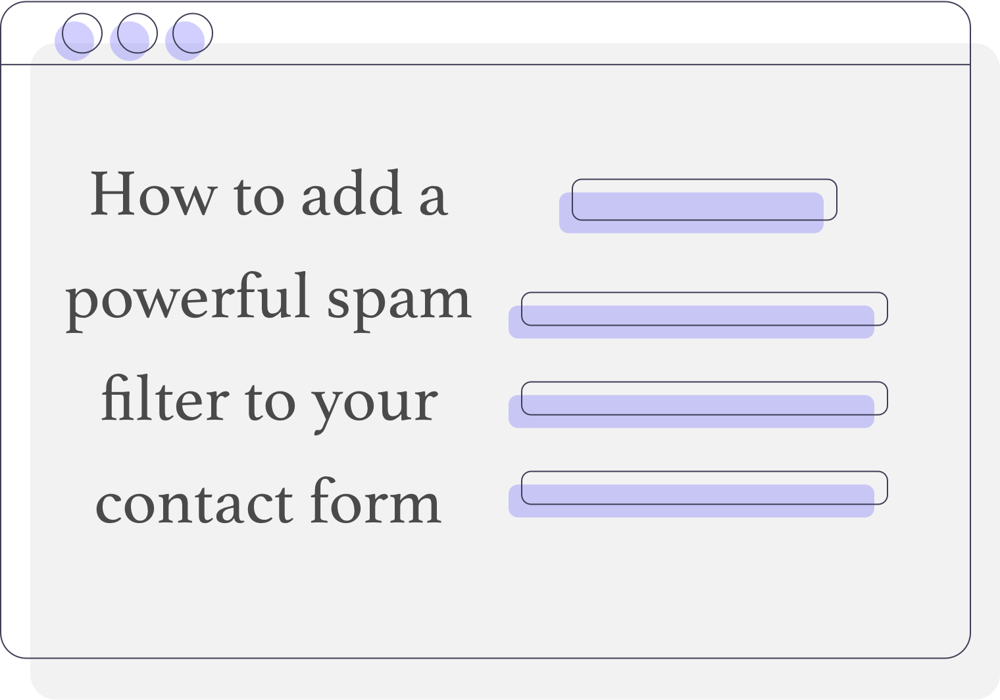
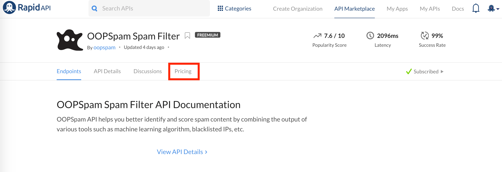
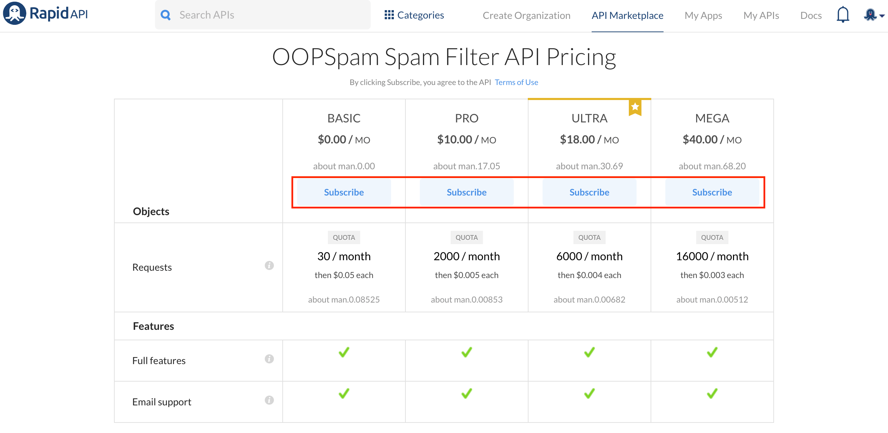
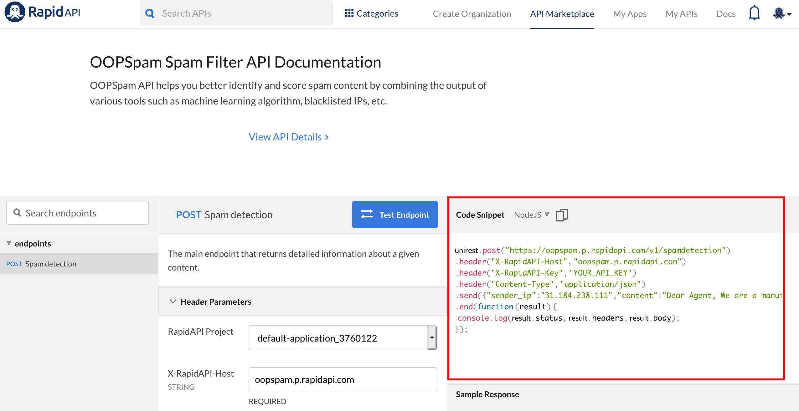

<center></center>

Let's starting with
## Why should you add a spam filter to your contact form?
If you have a contact form then you probably already know the amount of spam one can get daily. Usually, bots scan websites looking for a contact form on a website and fill up all fields. As a result, the owner of a website gets so much spam from a different source with a different context. These spambots are not only fill up form submissions and comment sections but also save your website in their database to save time in the future.
<center><blockquote class="twitter-tweet"><p lang="en" dir="ltr">Fun fact! There is a company with a database containing 25M websites. They fill up contact forms, solve the captcha for you and send 1M messages for $49. This is exactly what <a href="https://twitter.com/oopspamapi?ref_src=twsrc%5Etfw">@oopspamapi</a> fights against.</p>&mdash; 🐾 Onar (@OnarAlili) <a href="https://twitter.com/OnarAlili/status/1147141090023284736?ref_src=twsrc%5Etfw">July 5, 2019</a></blockquote> <script async src="https://platform.twitter.com/widgets.js" charset="utf-8"></script> </center>

Besides all this madness, bots are improving and overcoming spam prevention techniques. The honeypot technique, in fact, is almost obsolete for this reason. Another example would be reCaptcha by Google, Google itself announced that reCAPTCHA v2 can be bypassed by their own AI tools. Later Google announced [reCAPTCHA v3](https://www.google.com/recaptcha/intro/v3.html) which introduced an extra layer on top of the v2 by making it invisible (appears in case of a suspicious user). V3 is much more powerful in terms of accuracy and user-friendliness. However, there is one major problem (along with others). Spammers are not always bots, there are people you can hire for a very low-fare ($1 per hour) to spam people by solving captchas and filling out forms. Therefore, it makes sense not to rely on user behavior (reCAPTCHA) or on the chance that the bot is too dumb to figure which field is hidden (honeypot). OOPSpam API, on the other hand, stays in your backend and decides on multiple inputs. 
# How to integrate a contact form with OOPSpam API
Let's assume we run a digital agency website in English and you have a contact form in your HTML file:
```html
<form action="/send" method="post">
        <div class="half left cf">
        <input type="text" name="name" id="input-name" placeholder="Name" class="four columns">
        <input type="email" name="email" id="input-email" placeholder="Email address" class="four columns">
        <input type="text" name="subject" id="input-subject" placeholder="Subject" class="four columns">
        </div>
    <div class="half right cf">
        <textarea name="message" type="text" id="input-message" placeholder="Message" class="twelve columns"></textarea>
    </div>
    <input type="submit" value="Submit" id="input-submit" class="button-primary">
    </form>
```
As you may already know, once the _submit_ button is clicked the ```form``` element collects the value of all fields within the form tag and ```post``` them to the path assigned in ```action```. It means you have to have a backend code to receive these values and handle them. And this is where we have to write our spam filter API to check for spam.
Besides contact form field values, we have to get the user's IP, this is important because it allows us to check IP against multiple blacklisted IPs via the spam filter. 
Handling contact form submissions in the backend is different in various languages, however, the concept is similar. Handling submissions, here is how it may look like for you:
1. A user fills and submits a contact form
2. The user gets Success message no matter what (spam or not)
3. You receive contact form information
4. Get the user's IP address
5. Send the user's IP and the content of the contact form message to the OOPSpam API
6. The API returns a spam score
7. Forward contact form information to your email or ignore based on the spam score.
8. Done! 💪🏼

We are going to use Node.js for our backend but you can use any programming language you feel comfortable with. 

**Important**: Make sure you get user's IP in the server-side. Don't assign the API to a form field since a user (or bot) may alter IP address. 

To get started quickly, I'm going to fork [one of the contact form example projects](https://github.com/germancutraro/Contact-Form-nodejs) from GitHub and add an integration to OOPSpam API.
As mentioned above, we have to get a user's IP in the server-side. This is done differently in every language. 
In Node.js with express framework environment it would be as simple as checking under ```req.ip```.

In PHP like so:
```php
<?php echo $_SERVER['REMOTE_ADDR']; ?>
```
and in Java:
```java
import javax.servlet.http.HttpServletRequest;

String ipAddress = request.getRemoteAddr();
```

It is usually easy and straightforward. 

**Important:** Make sure an IP doesn't contain any IPv6 prefix (::ffff:127.0.0.1) or isn't IPv6 (2001:db8:85a3:8d3:1319:8a2e:370:7348). Currently, only IPv4 supported, IPv6 will be ignored.

Once you have the user's IP, time to make a request to OOPSpam API and forward legit contact form submission to your email. To request OOPSpam API, you have to have an API key. You get this key when you subscribe to one of the plans available on [OOPSpam API's RapidAPI page](https://rapidapi.com/oopspam/api/oopspam-spam-filter). There you will also find a ready-to-use example request which you can copy and paste into your project (it already contains your API key).
	
    
    
    
```javascript
unirest.post("https://oopspam.p.rapidapi.com/v1/spamdetection")
.header("X-RapidAPI-Host", "oopspam.p.rapidapi.com")
.header("X-RapidAPI-Key", "YOUR_API_KEY")
.header("Content-Type", "application/json")
.send({"sender_ip":"31.184.238.111","content":"Dear Agent, We are a manufacturing company which specializes in supplying Aluminum Rod with Zinc Alloy Rod to customers worldwide, based in Japan, Asia.We have been unable to follow up payments effectively for transactions with debtor customers in your country due to our distant locations, thus our reason for requesting for your services representation."})
.end(function (result) {
  console.log(result.status, result.headers, result.body);
});
```
As you can see above sample request, the payload contains two parameters:
- The sender IP (a user's IP)
- The message (a contact form message)

Make sure you change the value of ```X-RapidAPI-Key``` from ```YOUR_API_KEY``` to the API key.
In the case of a successful request, you will get a response similar to the following with HTTP status code ```200```: 
```json
{
"Score":4
    "Details":{
        "isIPBlocked":true
        "isContentSpam":"spam"
        "numberOfSpamWords":1
    }
}
```
Any other type of HTTP status needs to be handled accordingly.
### Error handling
In this example, if a returned status code anything other than ```200``` then we console out the body of the response. In case you didn't include necessary headers in your requests, for example, an API key which you will get status code ```401```  (Unauthorized) with an explanatory ```message``` as the part of response's body. Other possible errors can be :
- An invalid JSON format
- Generic error message

With all cases, you will get a JSON object with an error ```code``` and ```message``` which looks like this:
```json
{
    "code":"5740538",
    "message":"Invalid JSON format. Please verify and resubmit."
}
````

Back to having a successful request, as you can see in the snip of code above , the root field ```Score``` has a value of 4. It is safe to assume that a score equal to 3 or above is spam.  Thus, we are going to have a simple _if statement_ to consider this and do all the email forwarding inside this statement. Therefore, in the example below we consider scores that is less than 3 as ham (non-spam), otherwise, ignore the message.
<script src="https://gist.github.com/onaralili/b4d8238f31fff719cb7d845fcba4851b.js"></script>

Check out [OOPSpam API docs](https://rapidapi.com/oopspam/api/oopspam-spam-filter/details) to learn in detail about response parameters and much more.
You can also access the example project code on [Github](https://github.com/OOPSpam/Contact-Form-nodejs). Let me know if you have any question via contact@oopspam.com.
