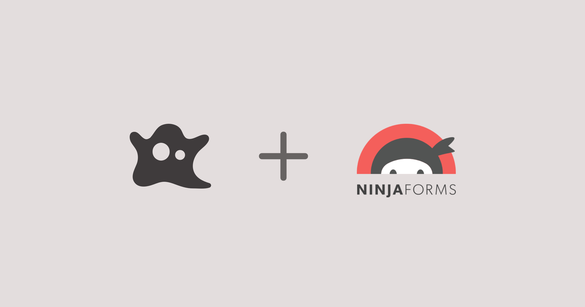
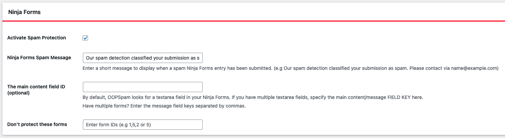
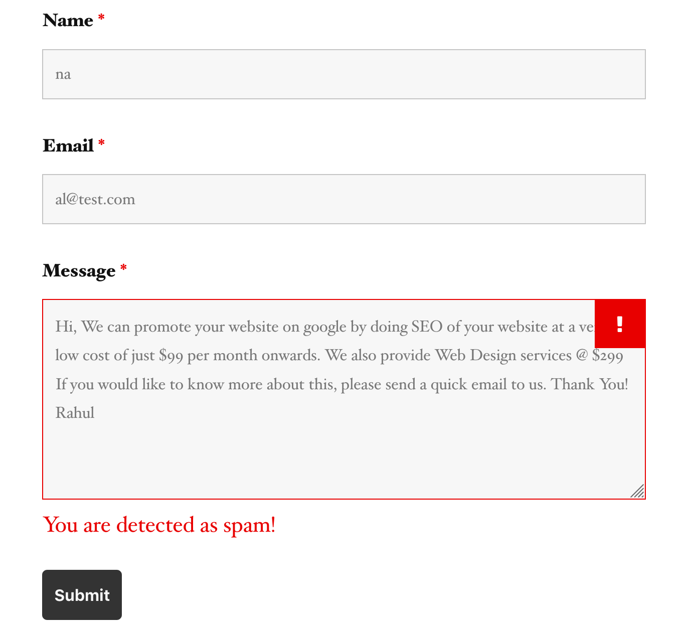

Recently, we announced the [OOPSpam Anti-Spam WordPress plugin](https://wordpress.org/plugins/oopspam-anti-spam/) which uses OOPSpam Anti-Spam API to filter spam on your comment. Very soon we realized that many people also concern about spam through contact forms. In fact, most of the requests to OOPSpam Anti-Spam API are coming from contact form submissions. 

A few days ago we published a new update to our WordPress plugin. This update brings [Ninja Forms](https://ninjaforms.com/) support. If you are familiar with WordPress contact form solution then you hear about Ninja Forms. Ninja Forms is a powerful plugin that supports form drag&drop form building and many add-ons for any custom needs. It has a free and premium version. The free version is pretty flexible and allows you to get started quickly. 
Although, Ninja Forms has already built-in support for spam protection. Those are Honeypot and Captcha methods. I wrote shortly about how these techniques are not reliable anymore [here](https://www.oopspam.com/blog/2019-07-25/how-to-add-spamfilter-to-a-contact-form).  

With this update, all your Ninja Forms submission will go through the OOPSpam Anti-Spam API. 
Here are a few steps to activate spam protection for Ninja Forms:

1. You have to [Subscribe to the API](https://rapidapi.com/oopspam/api/oopspam-spam-filter) then copy-paste the API key to the plugin's appropriate field under __Settings->OOPSpam Anti-Spam__ on your WordPress Admin Dashboard.
2. If you have a Ninja Forms installed and activated then a special section will appear on OOPSpam Anti-Spam plugin's setting page.

3. On this page, you need to activate Ninja Forms Spam Protection by checking the Activate Spam Protection checkbox. 
4. Don't forget to enter a short message to display when a spam Ninja Forms entry has been submitted.

That is all! Now go on and create your forms.

Once spam detected your message will appear on the bottom of the message field.

